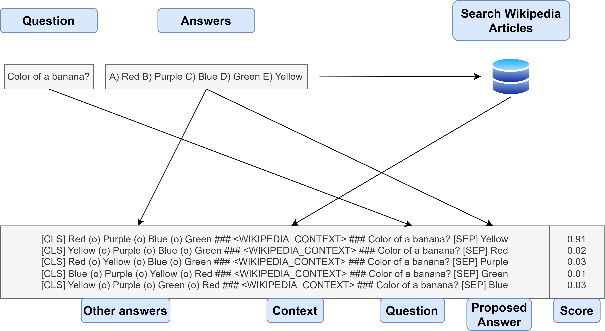

## LLM Science Exam Competition

This repository contains code for the 191st place solution in the [Kaggle - LLM Science Exam competition](https://www.kaggle.com/competitions/kaggle-llm-science-exam) on Kaggle. The complete solution write-up is [here](https://www.kaggle.com/competitions/kaggle-llm-science-exam/discussion/446229).

<h1 align="center">

</h1>

## Future Improvements

Retrieval/Reranking
- Could have fine-tuned retrieval/re-ranker models to QA with wikipedia data
- Should have focused more on evaluating RAG performance
- Ensembled different retrieval models
- Should have used multiple wiki sources (Different sources were missing different pieces)

LLM
- Should have experimented with a larger LLM using PEFT (7-13 billion params)
  - 1st place solution suggests that LLM w/ LORA fine tune would have boosted score by (~0.01) and gotten me into top 50!
- Should have ensembled diverse models here
- Can speed up inference by caching context for decoder only models?
  - comment [here](https://www.kaggle.com/competitions/kaggle-llm-science-exam/discussion/446240#2476830), Example [here](https://www.kaggle.com/code/simjeg/platypus2-70b-with-wikipedia-rag?scriptVersionId=145471658&cellId=11)

CV
- Should have focused on setting up a correlated CV early in the competition
- Should have used a validation set more representative of competition LB/PB

## Other Attempts

- Prefix-tuning w/ Flan-T5
- SOTA retrieval models (bge-base-en-v1.5, gte-base, all-mpnet-base-v2, etc.)

## Positives

- Collected >7 million English Wikipedia articles
- Enhanced Huggingface `AutoModelForMultipleChoice` class by adding other answers as context
- Sharded FAISS to fit large retrieval model in <13GB of RAM
- Setup a decent create_data pipeline to test retrieval hyperparameters
